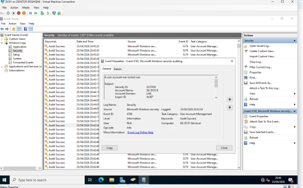
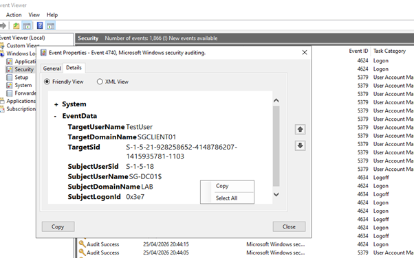
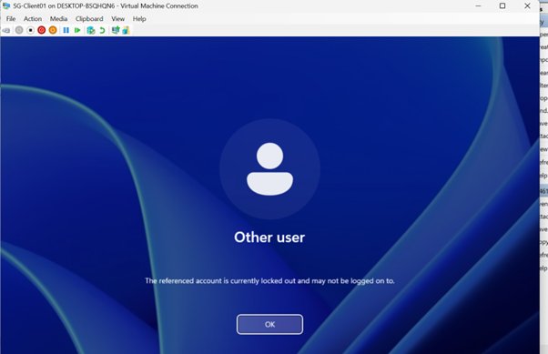

# Account Lockout Investigation – Active Directory Lab

## 📌 Summary
This lab simulated an account lockout scenario in an Active Directory environment. Repeated failed login attempts were used to trigger the domain lockout policy, and the resulting security events were analysed on the Domain Controller.

The objective was to understand how Active Directory responds to repeated authentication failures and how these events are represented in Windows Security logs.

---

## 🏗️ Lab Setup

This lab was built on an existing Active Directory environment (Lab 1).

### Account Lockout Policy Configuration:
Configured via:

Computer Configuration → Policies → Windows Settings → Security Settings → Account Policies → Account Lockout Policy

Settings applied:
- Account lockout duration: 15 minutes  
- Account lockout threshold: 5 invalid login attempts  
- Reset account lockout counter after: 15 minutes  

Policy was applied using:
- `gpupdate /force`

---

## ⚔️ Attack Simulation

From the client machine, multiple incorrect login attempts were made against the domain user account:

- Username: `lab\testuser`  
- 5 consecutive invalid password attempts were entered  

This triggered the account lockout policy configured in Active Directory.

---

## 📊 Log Analysis

Logs were reviewed on the Domain Controller using:

Event Viewer → Windows Logs → Security

### 🔴 Event ID 4740 – Account Lockout
The primary event observed was Event ID 4740, confirming that the user account was locked due to repeated failed authentication attempts.

This event included:
- Target account: `testuser`  
- Source machine: SG-Client01  
- Timestamp of lockout  

---

## 🧠 Analysis

The presence of Event ID 4740 confirms that the Active Directory account lockout policy successfully detected and responded to repeated failed authentication attempts.

In this lab, a clear “build-up” of individual failed logon events was not consistently visible in the Security logs. This can occur in Active Directory environments due to differences in authentication processing (Kerberos vs NTLM) and how Windows aggregates or records authentication failures.

As a result, the lockout event (4740) served as the primary and most reliable indicator of repeated failed authentication activity.

This reflects real-world SOC investigations, where analysts often rely on outcome-based events rather than perfectly sequential logs.

---

## 📸 Evidence

The following screenshots are included:

- Event ID 4740 showing account lockout details
- 

- Expanded 4740 event showing user and source machine
- 
  
- Client-side lockout message indicating restricted access
-  

---

## 🚨 Conclusion

This lab demonstrates how Active Directory enforces account lockout policies in response to repeated failed login attempts.

Key findings:
- Account lockout was successfully triggered after 5 failed attempts  
- Event ID 4740 confirmed enforcement of security controls  
- Failed authentication logs may not always appear as a clear sequential pattern in Security logs  

This highlights an important SOC principle: analysts must correlate system outcomes and security events rather than relying on complete attack visibility in logs.
